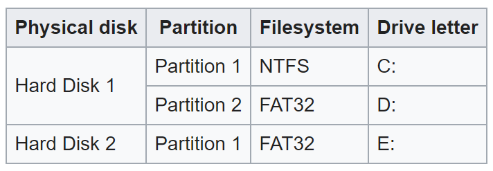

# Volume Management on Clouds

* sp20-516-222 Peter McCandless

## Introduction

Volume on a physical disk is defined by Microsoft as “a unit of disk space composed as one or more sections of one or more disks” with a simple volume being a single portion of one disk [@sp20-516-222_MicrosoftTermonology].

{#fig:sp20-516-222-physicaldisk}

Volume in the cloud can be manipulated to optimally accommodate the process being performed and the data being stored in the cloud.  There are a few types of storage in the cloud.  File storage typically takes the same hierarchical structure as a directory with a path to each file.  Object storage usually takes the form of a data lake in which unstructured data is labeled with metadata that is used to locate the data for processing and analysis.  Block storage volumes with specified sizes are created as needed and can be mounted to each other. [2].      

[1] <https://docs.microsoft.com/en-us/previous-versions/tn-archive/dd163557(v=technet.10)?redirectedfrom=MSDN>

[2] <https://aws.amazon.com/what-is-cloud-storage/>
   
[3] <https://docs.cloud.oracle.com/en-us/iaas/Content/Block/Concepts/overview.htm>
